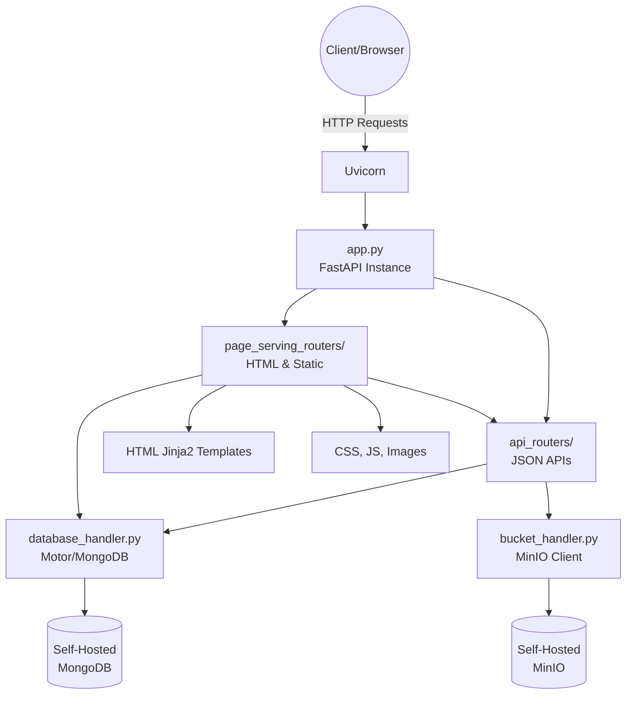

# Project Overview: Flask to FastAPI Migration

## Project Summary
The project involves migrating the existing **Brands_out_loud** Flask application to a modern **FastAPI** architecture. This migration replaces all managed Supabase services (PostgreSQL and Storage) with completely self-hosted solutions (**MongoDB** and **MinIO**). The new architecture enforces a strict separation of concerns among configuration, service handlers, API routers, and page-rendering routers.

## High-Level Architecture

## Step Sequence and Dependencies
1. **Step 01: Core Setup & Configuration**: Set up FastAPI structure, `requirements.txt`, environment variables.
2. **Step 02: Database Handler (MongoDB)**: Implement `database_handler/` using Motor.
3. **Step 03: Bucket Handler (MinIO)**: Implement `bucket_handler/` using MinIO Client.
4. **Step 04: API Routers**: Build the decoupled JSON endpoints (formerly part of `app.py`).
5. **Step 05: Page Serving Routers**: Build Jinja2 HTML endpoints and static file serving.
6. **Step 06: Main App Assembly**: Assemble Routers in `app.py` and finalize `railway.json`.

## Overall Timeline Estimate
- Phase 1 (Setup & Handlers): 1-2 Days
- Phase 2 (Routers & Views Migration): 3-5 Days
- Phase 3 (Testing & Refinement): 1-2 Days
**Total Estimate**: 1 to 2 Weeks (assuming 1 developer working consistently)
